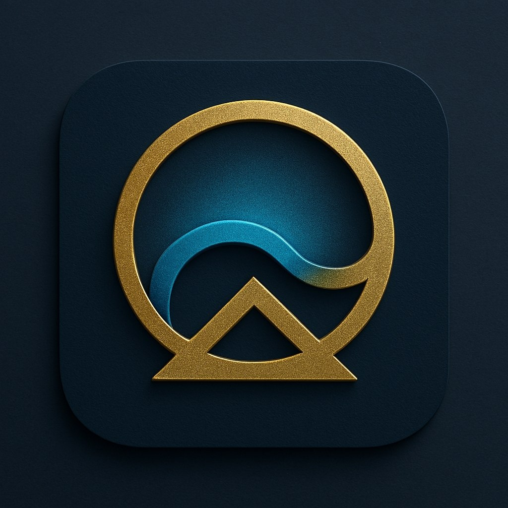

  

<h1 align="center">NoraCivilis</h1>

A Multi‑Layer, Multi‑Engine, Self‑Evolving Civilization 
Operating System

!

---### NoraCivilis Architecture — Visual Set

  
  
  

## 🌍 What is NoraCivilis?

NoraCivilis is not a bot.  
NoraCivilis is a **Civilization Operating System** — a modular, multi‑engine, multi‑layer digital intelligence stack designed to simulate, evolve, and govern a living digital civilization.
It includes:

🧠 Heart System
Open Folder (github.com in Bing)

---

🧬 Evolution Engine
(Mother Pillars – evolution-engine)  
Open Folder (github.com in Bing)

---

🧩 Pattern Engine
Open Folder (github.com in Bing)

---

🏛 Governance Engine
(قوانین اخلاقی و حکمرانی)  
Open Folder (github.com in Bing)

---

🧘 Healing Engine
(v3 self‑healing system)  
Open Folder (github.com in Bing)

---

🪪 Identity Engine
Open Folder (github.com in Bing)

---

📜 Law Engine
(rules folder)  
Open Folder (github.com in Bing)

---

🧱 Memory System
(meta‑memory engine)  
Open Folder (github.com in Bing)

---

🔐 Security Engine
Open Folder (github.com in Bing)

---

🌐 Gateway System
(API, Telegram, Gmail gateways)  
Open Folder (github.com in Bing)

---

## 📚 Full Documentation

- [Plus Edition — Full Architecture](docs/README.plus.md)
- [Pro Edition — Diagrams & System Maps](docs/README.pro.md)
- [Ultra Edition — 10 Civilization Layers](docs/README.ultra.md)
- [Dev Edition — Developer Documentation](docs/README.dev.md)

---

## 📄 Project Documents

- [LICENSE](./LICENSE)
- [CONTRIBUTING](./CONTRIBUTING.md)
- [ROADMAP](./ROADMAP.md)

---

## 🌐 Documentation Languages

- 🇬🇧 [English Documentation](README.en.md)

Planned:

- 🇮🇷 Persian (coming soon)
- 🇹🇷 Turkish (coming soon)
- 🇦🇪 Arabic (coming soon)
- 🇷🇺 Russian (coming soon)
  
---

## 🏛 NoraCivilis  
A civilization that thinks, evolves, 
remembers, heals, governs, and grows.
